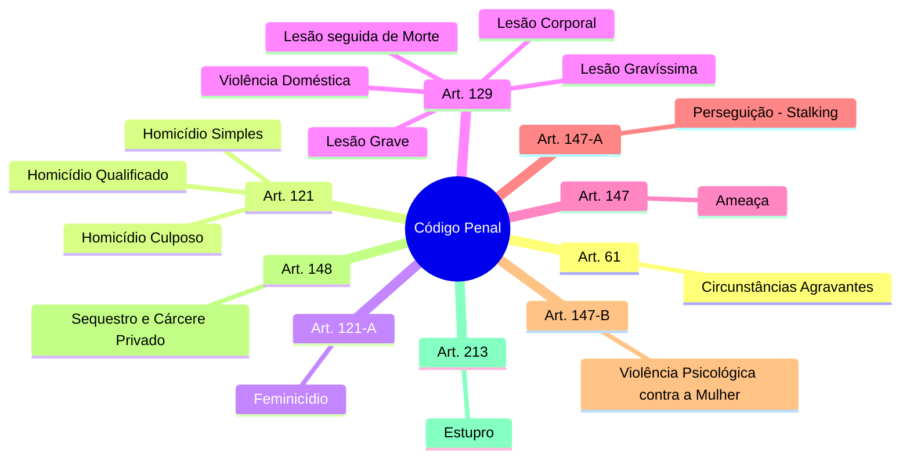
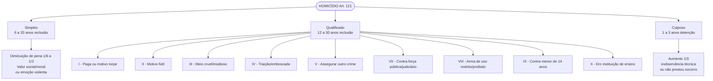
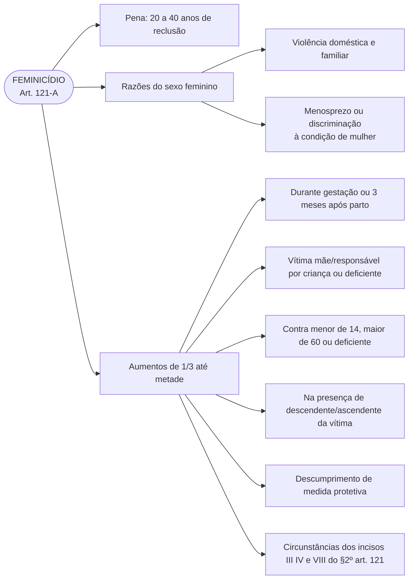
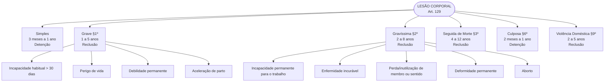
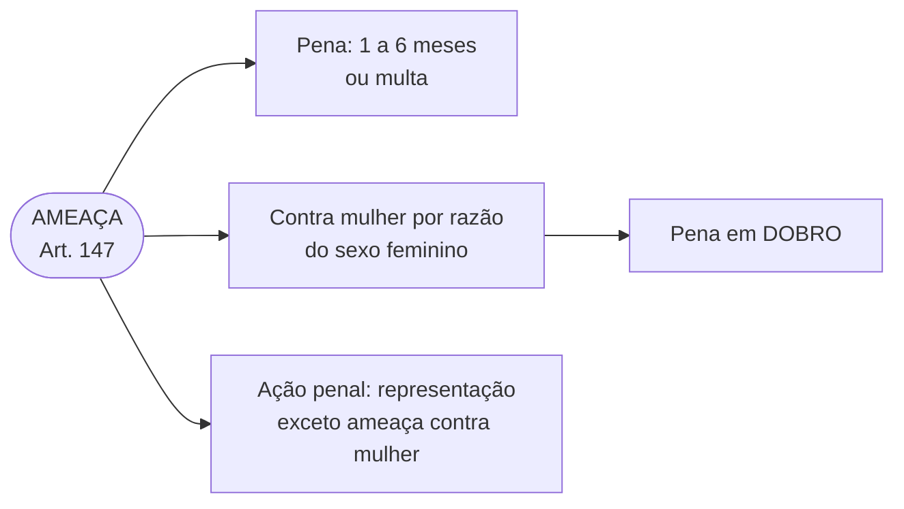
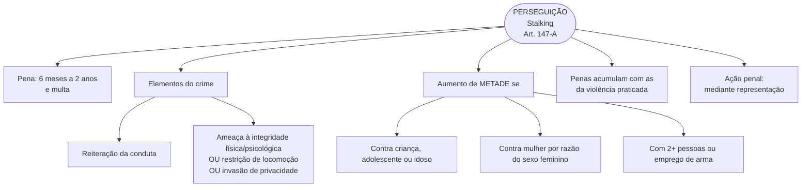
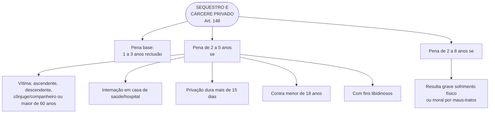
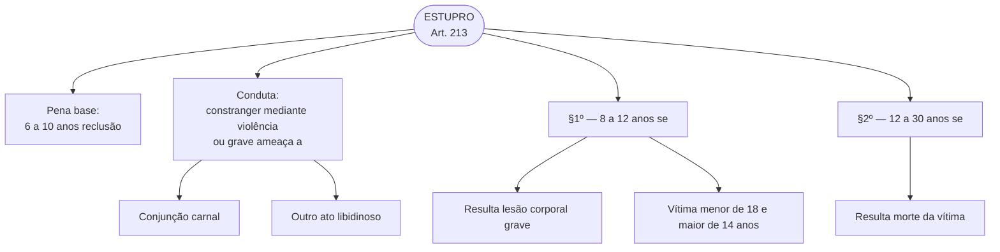
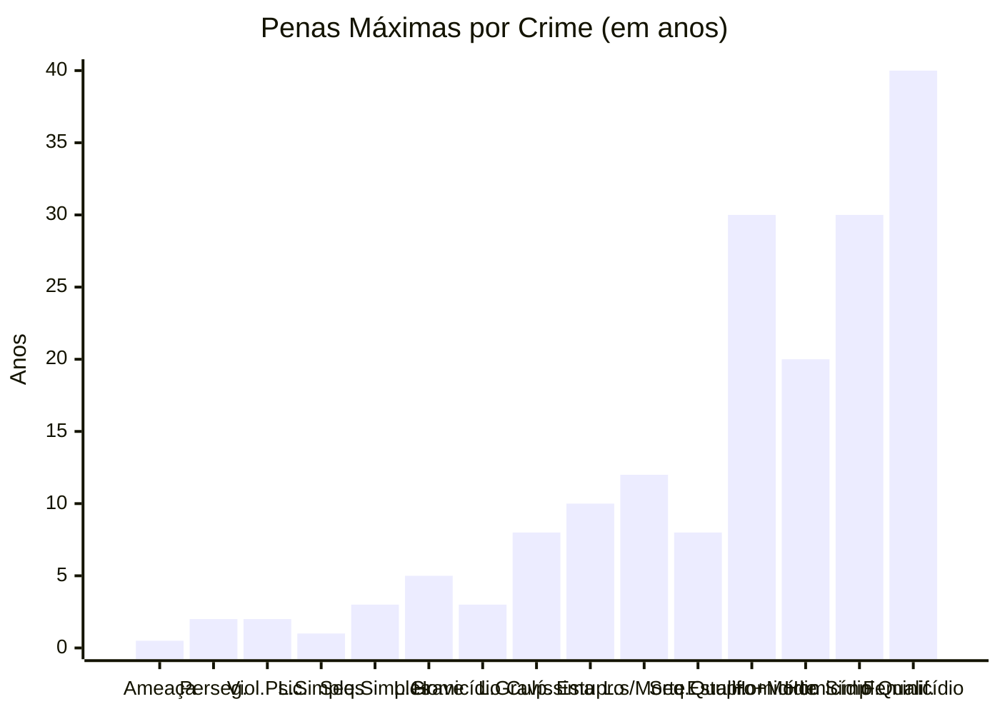
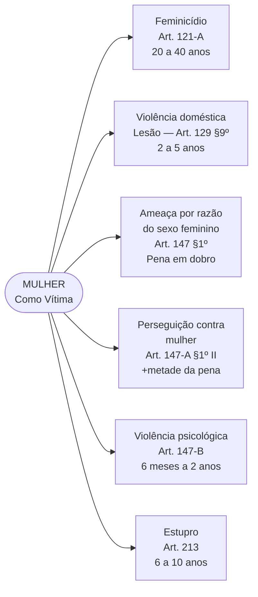

### Códico Penal

**Circunstâncias agravantes**

Art. 61 - São circunstâncias que sempre agravam a pena, quando não constituem ou qualificam o crime:[(Redação dada pela Lei nº 7.209, de 11.7.1984)](https://www.planalto.gov.br/ccivil_03/LEIS/1980-1988/L7209.htm#art61)

II - ter o agente cometido o crime: [(Redação dada pela Lei nº 7.209, de 11.7.1984)](https://www.planalto.gov.br/ccivil_03/LEIS/1980-1988/L7209.htm#art61)

a) por motivo fútil ou torpe;

b) para facilitar ou assegurar a execução, a ocultação, a impunidade ou vantagem de outro crime;

c) à traição, de emboscada, ou mediante dissimulação, ou outro recurso que dificultou ou tornou impossível a defesa do ofendido;

d) com emprego de veneno, fogo, explosivo, tortura ou outro meio insidioso ou cruel, ou de que podia resultar perigo comum;

e) contra ascendente, descendente, irmão ou cônjuge;

f) com abuso de autoridade ou prevalecendo-se de relações domésticas, de coabitação ou de hospitalidade, ou com violência contra a mulher na forma da lei específica; [(Redação dada pela Lei nº 11.340, de 2006)](https://www.planalto.gov.br/ccivil_03/_Ato2004-2006/2006/Lei/L11340.htm#art43)

g) com abuso de poder ou violação de dever inerente a cargo, ofício, ministério ou profissão;

h) contra criança, maior de 60 (sessenta) anos, enfermo ou mulher grávida; [(Redação dada pela Lei nº 10.741, de 2003)](https://www.planalto.gov.br/ccivil_03/LEIS/2003/L10.741.htm#art61iih)

i) quando o ofendido estava sob a imediata proteção da autoridade;

j) em ocasião de incêndio, naufrágio, inundação ou qualquer calamidade pública, ou de desgraça particular do ofendido;

l) em estado de embriaguez preordenada.

m) nas dependências de instituição de ensino.     [(Incluído pela Lei nº 15.159, de 2025)](https://www.planalto.gov.br/ccivil_03/_Ato2023-2026/2025/Lei/L15159.htm#art2)

**Lesão corporal**

Art. 129. Ofender a integridade corporal ou a saúde de outrem:

Pena - detenção, de três meses a um ano.

**Lesão corporal de natureza grave**

§ 1º Se resulta:

I - Incapacidade para as ocupações habituais, por mais de trinta dias;

II - perigo de vida;

III - debilidade permanente de membro, sentido ou função;

IV - aceleração de parto:

Pena - reclusão, de um a cinco anos.

§ 2° Se resulta:

I - Incapacidade permanente para o trabalho;

II - enfermidade incuravel;

III perda ou inutilização do membro, sentido ou função;

IV - deformidade permanente;

V - aborto:

Pena - reclusão, de dois a oito anos.

**Lesão corporal seguida de morte**

§ 3° Se resulta morte e as circunstâncias evidenciam que o agente não quís o resultado, nem assumiu o risco de produzí-lo:

Pena - reclusão, de quatro a doze anos.

**Diminuição de pena**

§ 4° Se o agente comete o crime impelido por motivo de relevante valor social ou moral ou sob o domínio de violenta emoção, logo em seguida a injusta provocação da vítima, o juiz pode reduzir a pena de um sexto a um terço.

**Substituição da pena**

§ 5° O juiz, não sendo graves as lesões, pode ainda substituir a pena de detenção pela de multa, de duzentos mil réis a dois contos de réis:

I - se ocorre qualquer das hipóteses do parágrafo anterior;

II - se as lesões são recíprocas.

**Lesão corporal culposa**

     § 6° Se a lesão é culposa: [(Vide Lei nº 4.611, de 1965)](https://www.planalto.gov.br/ccivil_03/LEIS/1950-1969/L4611.htm#art1)

Pena - detenção, de dois meses a um ano.

**Aumento de pena**

§ 7o  Aumenta-se a pena de 1/3 (um terço) se ocorrer qualquer das hipóteses dos §§ 4o e 6o do art. 121 deste Código.        [(Redação dada pela Lei nº 12.720, de 2012)](https://www.planalto.gov.br/ccivil_03/_Ato2011-2014/2012/Lei/L12720.htm#art3)

     § 8º - Aplica-se à lesão culposa o disposto no § 5º do art. 121.[(Redação dada pela Lei nº 8.069, de 1990)](https://www.planalto.gov.br/ccivil_03/LEIS/L8069.htm#art129%C2%A77)

**Violência Doméstica**    [(Incluído pela Lei nº 10.886, de 2004)](https://www.planalto.gov.br/ccivil_03/_Ato2004-2006/2004/Lei/L10.886.htm#art1)

§ 9o  Se a lesão for praticada contra ascendente, descendente, irmão, cônjuge ou companheiro, ou com quem conviva ou tenha convivido, ou, ainda, prevalecendo-se o agente das relações domésticas, de coabitação ou de hospitalidade: [(Redação dada pela Lei nº 11.340, de 2006)](https://www.planalto.gov.br/ccivil_03/_Ato2004-2006/2006/Lei/L11340.htm#art44)
       Pena – reclusão, de 2 (dois) a 5 (cinco) anos.      [(Redação dada pela Lei nº 14.994, de 2024)](https://www.planalto.gov.br/ccivil_03/_Ato2023-2026/2024/Lei/L14994.htm#art1)

§ 10. Nos casos previstos nos §§ 1o a 3o deste artigo, se as circunstâncias são as indicadas no § 9o deste artigo, aumenta-se a pena em 1/3 (um terço). [(Incluído pela Lei nº 10.886, de 2004)](https://www.planalto.gov.br/ccivil_03/_Ato2004-2006/2004/Lei/L10.886.htm#art1)

§ 11.  Na hipótese do § 9o deste artigo, a pena será aumentada de um terço se o crime for cometido contra pessoa portadora de deficiência. [(Incluído pela Lei nº 11.340, de 2006)](https://www.planalto.gov.br/ccivil_03/_Ato2004-2006/2006/Lei/L11340.htm#art44)

§ 12. Aumenta-se a pena de:       [(Redação dada pela Lei nº 15.159, de 2025)](https://www.planalto.gov.br/ccivil_03/_Ato2023-2026/2025/Lei/L15159.htm#art2)

I - 1/3 (um terço) a 2/3 (dois terços) se a lesão dolosa for praticada:     [(Redação dada pela Lei nº 15.159, de 2025)](https://www.planalto.gov.br/ccivil_03/_Ato2023-2026/2025/Lei/L15159.htm#art2)

a) contra autoridade ou agente descrito nos [arts. 142](https://www.planalto.gov.br/ccivil_03/Constituicao/Constituicao.htm#art142) e [144 da Constituição Federal](https://www.planalto.gov.br/ccivil_03/Constituicao/Constituicao.htm#art144) ou integrantes do sistema prisional ou da Força Nacional de Segurança Pública, no exercício da função ou em decorrência dela, ou contra seu cônjuge, companheiro ou parente consanguíneo até terceiro grau, em razão dessa condição;      [(Incluído pela Lei nº 15.159, de 2025)](https://www.planalto.gov.br/ccivil_03/_Ato2023-2026/2025/Lei/L15159.htm#art2)

b) contra membro do Poder Judiciário, do Ministério Público, da Defensoria Pública ou da Advocacia Pública, de que tratam os [arts. 131](https://www.planalto.gov.br/ccivil_03/Constituicao/Constituicao.htm#art131) e [132 da Constituição Federal,](https://www.planalto.gov.br/ccivil_03/Constituicao/Constituicao.htm#art132) ou oficial de justiça, no exercício da função ou em decorrência dela, ou contra seu cônjuge, companheiro ou parente, inclusive por afinidade, até o terceiro grau, em razão dessa condição; ou       [(Incluído pela Lei nº 15.159, de 2025)](https://www.planalto.gov.br/ccivil_03/_Ato2023-2026/2025/Lei/L15159.htm#art2)

c) nas dependências de instituição de ensino;      [(Incluído pela Lei nº 15.159, de 2025)](https://www.planalto.gov.br/ccivil_03/_Ato2023-2026/2025/Lei/L15159.htm#art2)

II - 2/3 (dois terços) ao dobro se a lesão dolosa for praticada nas dependências de instituição de ensino e:    [(Redação dada pela Lei nº 15.159, de 2025)](https://www.planalto.gov.br/ccivil_03/_Ato2023-2026/2025/Lei/L15159.htm#art2)

a) a vítima for pessoa com deficiência ou com doença que acarrete condição limitante ou de vulnerabilidade física ou mental; ou     [(Incluído pela Lei nº 15.159, de 2025)](https://www.planalto.gov.br/ccivil_03/_Ato2023-2026/2025/Lei/L15159.htm#art2)

b) o autor for ascendente, padrasto ou madrasta, tio, irmão, cônjuge, companheiro, tutor, curador, preceptor ou empregador da vítima ou por qualquer outro título tiver autoridade sobre ela ou, ainda, for professor ou funcionário da instituição de ensino.    [(Incluído pela Lei nº 15.159, de 2025)](https://www.planalto.gov.br/ccivil_03/_Ato2023-2026/2025/Lei/L15159.htm#art2)

§ 13. Se a lesão é praticada contra a mulher, por razões da condição do sexo feminino, nos termos do § 1º do art. 121-A deste Código:      [(Redação dada pela Lei nº 14.994, de 2024)](https://www.planalto.gov.br/ccivil_03/_Ato2023-2026/2024/Lei/L14994.htm#art1)

Pena – reclusão, de 2 (dois) a 5 (cinco) anos.    [(Redação dada pela Lei nº 14.994, de 2024)](https://www.planalto.gov.br/ccivil_03/_Ato2023-2026/2024/Lei/L14994.htm#art1)

**Ameaça**

Art. 147 - Ameaçar alguém, por palavra, escrito ou gesto, ou qualquer outro meio simbólico, de causar-lhe mal injusto e grave:

Pena - detenção, de um a seis meses, ou multa.

§ 1º Se o crime é cometido contra a mulher por razões da condição do sexo feminino, nos termos do § 1º do art. 121-A deste Código, aplica-se a pena em dobro.     [(Incluído pela Lei nº 14.994, de 2024)](https://www.planalto.gov.br/ccivil_03/_Ato2023-2026/2024/Lei/L14994.htm#art1)

§ 2º Somente se procede mediante representação, exceto na hipótese prevista no § 1º deste artigo.    [(Incluído pela Lei nº 14.994, de 2024)](https://www.planalto.gov.br/ccivil_03/_Ato2023-2026/2024/Lei/L14994.htm#art1)

**Perseguição**

Art. 147-A.  Perseguir alguém, reiteradamente e por qualquer meio, ameaçando-lhe a integridade física ou psicológica, restringindo-lhe a capacidade de locomoção ou, de qualquer forma, invadindo ou perturbando sua esfera de liberdade ou privacidade.       [(Incluído pela Lei nº 14.132, de 2021)](https://www.planalto.gov.br/ccivil_03/_Ato2019-2022/2021/Lei/L14132.htm#art2)

Pena – reclusão, de 6 (seis) meses a 2 (dois) anos, e multa.       [(Incluído pela Lei nº 14.132, de 2021)](https://www.planalto.gov.br/ccivil_03/_Ato2019-2022/2021/Lei/L14132.htm#art2)

§ 1º A pena é aumentada de metade se o crime é cometido:        [(Incluído pela Lei nº 14.132, de 2021)](https://www.planalto.gov.br/ccivil_03/_Ato2019-2022/2021/Lei/L14132.htm#art2)

I – contra criança, adolescente ou idoso;      [(Incluído pela Lei nº 14.132, de 2021)](https://www.planalto.gov.br/ccivil_03/_Ato2019-2022/2021/Lei/L14132.htm#art2)

II – contra mulher por razões da condição de sexo feminino, nos termos do § 2º-A do art. 121 deste Código;       [(Incluído pela Lei nº 14.132, de 2021)](https://www.planalto.gov.br/ccivil_03/_Ato2019-2022/2021/Lei/L14132.htm#art2)

III – mediante concurso de 2 (duas) ou mais pessoas ou com o emprego de arma.        [(Incluído pela Lei nº 14.132, de 2021)](https://www.planalto.gov.br/ccivil_03/_Ato2019-2022/2021/Lei/L14132.htm#art2)

§ 2º  As penas deste artigo são aplicáveis sem prejuízo das correspondentes à violência.       [(Incluído pela Lei nº 14.132, de 2021)](https://www.planalto.gov.br/ccivil_03/_Ato2019-2022/2021/Lei/L14132.htm#art2)

§ 3º  Somente se procede mediante representação.      [(Incluído pela Lei nº 14.132, de 2021)](https://www.planalto.gov.br/ccivil_03/_Ato2019-2022/2021/Lei/L14132.htm#art2)

Violência psicológica contra a mulher   [(Incluído pela Lei nº 14.188, de 2021)](https://www.planalto.gov.br/ccivil_03/_Ato2019-2022/2021/Lei/L14188.htm#art4)

Art. 147-B.  Causar dano emocional à mulher que a prejudique e perturbe seu pleno desenvolvimento ou que vise a degradar ou a controlar suas ações, comportamentos, crenças e decisões, mediante ameaça, constrangimento, humilhação, manipulação, isolamento, chantagem, ridicularização, limitação do direito de ir e vir ou qualquer outro meio que cause prejuízo à sua saúde psicológica e autodeterminação:     [(Incluído pela Lei nº 14.188, de 2021)](https://www.planalto.gov.br/ccivil_03/_Ato2019-2022/2021/Lei/L14188.htm#art4)

Pena - reclusão, de 6 (seis) meses a 2 (dois) anos, e multa, se a conduta não constitui crime mais grave.    [(Incluído pela Lei nº 14.188, de 2021)](https://www.planalto.gov.br/ccivil_03/_Ato2019-2022/2021/Lei/L14188.htm#art4)

Parágrafo único. A pena é aumentada de metade se o crime é cometido mediante uso de inteligência artificial ou de qualquer outro recurso tecnológico que altere imagem ou som da vítima.    [(Incluído pela Lei nº 15.123, de 2025)](https://www.planalto.gov.br/ccivil_03/_Ato2023-2026/2025/Lei/L15123.htm#art2)

**Seqüestro e cárcere privado**
        Art. 148 - Privar alguém de sua liberdade, mediante seqüestro ou cárcere privado:         [(Vide Lei nº 10.446, de 2002)](https://www.planalto.gov.br/ccivil_03/LEIS/2002/L10446.htm#art1i)
        Pena - reclusão, de um a três anos.
        § 1º - A pena é de reclusão, de dois a cinco anos:

I – se a vítima é ascendente, descendente, cônjuge ou companheiro do agente ou maior de 60 (sessenta) anos;         [(Redação dada pela Lei nº 11.106, de 2005)](https://www.planalto.gov.br/ccivil_03/_Ato2004-2006/2005/Lei/L11106.htm#art1)

II - se o crime é praticado mediante internação da vítima em casa de saúde ou hospital;
        III - se a privação da liberdade dura mais de quinze dias.
        IV – se o crime é praticado contra menor de 18 (dezoito) anos;          [(Incluído pela Lei nº 11.106, de 2005)](https://www.planalto.gov.br/ccivil_03/_Ato2004-2006/2005/Lei/L11106.htm#art148%C2%A71iv)
        V – se o crime é praticado com fins libidinosos.          [(Incluído pela Lei nº 11.106, de 2005)](https://www.planalto.gov.br/ccivil_03/_Ato2004-2006/2005/Lei/L11106.htm#art148%C2%A71v)
        § 2º - Se resulta à vítima, em razão de maus-tratos ou da natureza da detenção, grave sofrimento físico ou moral:
        Pena - reclusão, de dois a oito anos.

**Homicídio simples**

Art. 121. Matar alguem:

Pena - reclusão, de seis a vinte anos.

**Caso de diminuição de pena**

§ 1º Se o agente comete o crime impelido por motivo de relevante valor social ou moral, ou sob o domínio de violenta emoção, logo em seguida a injusta provocação da vítima, o juiz pode reduzir a pena de um sexto a um terço.

**Homicídio qualificado**

§ 2° Se o homicídio é cometido:

I - mediante paga ou promessa de recompensa, ou por outro motivo torpe;

II - por motivo futil;

III - com emprego de veneno, fogo, explosivo, asfixia, tortura ou outro meio insidioso ou cruel, ou de que possa resultar perigo comum;

IV - à traição, de emboscada, ou mediante dissimulação ou outro recurso que dificulte ou torne impossivel a defesa do ofendido;

V - para assegurar a execução, a ocultação, a impunidade ou vantagem de outro crime:

   Pena - reclusão, de doze a trinta anos.

**Feminicídio**       [(Incluído pela Lei nº 13.104, de 2015)](https://www.planalto.gov.br/ccivil_03/_Ato2015-2018/2015/Lei/L13104.htm#art1)
VI - [(Revogado pela Lei nº 14.994, de 2024)](https://www.planalto.gov.br/ccivil_03/_Ato2023-2026/2024/Lei/L14994.htm#art9)
VII – contra:    [(Redação dada pela Lei nº 15.134, de 2025)](https://www.planalto.gov.br/ccivil_03/_Ato2023-2026/2025/Lei/L15134.htm#art6)
a) autoridade ou agente descrito nos [arts. 142](https://www.planalto.gov.br/ccivil_03/Constituicao/Constituicao.htm#art142) e [144 da Constituição Federal](https://www.planalto.gov.br/ccivil_03/Constituicao/Constituicao.htm#art144), integrantes do sistema prisional e da Força Nacional de Segurança Pública, no exercício da função ou em decorrência dela, ou contra seu cônjuge, companheiro ou parente consanguíneo até o terceiro grau, em razão dessa condição;     [(Incluída pela Lei nº 15.134, de 2025)](https://www.planalto.gov.br/ccivil_03/_Ato2023-2026/2025/Lei/L15134.htm#art6)
b) membro do Poder Judiciário, do Ministério Público, da Defensoria Pública ou da Advocacia Pública, de que tratam os [arts. 131](https://www.planalto.gov.br/ccivil_03/Constituicao/Constituicao.htm#art131) e [132 da Constituição Federal](https://www.planalto.gov.br/ccivil_03/Constituicao/Constituicao.htm#art132), ou oficial de justiça, no exercício da função ou em decorrência dela, ou contra seu cônjuge, companheiro ou parente, inclusive por afinidade, até o terceiro grau, em razão dessa condição;     [(Incluída pela Lei nº 15.134, de 2025)](https://www.planalto.gov.br/ccivil_03/_Ato2023-2026/2025/Lei/L15134.htm#art6)
VIII - com emprego de arma de fogo de uso restrito ou proibido:         [(Incluído pela Lei nº 13.964, de 2019)](https://www.planalto.gov.br/ccivil_03/_Ato2019-2022/2019/Lei/L13964.htm#art2)       [(Vigência)](https://www.planalto.gov.br/ccivil_03/_Ato2019-2022/2019/Lei/L13964.htm#art20)
Homicídio contra menor de 14 (quatorze) anos        [(Incluído pela Lei nº 14.344, de 2022)](https://www.planalto.gov.br/ccivil_03/_Ato2019-2022/2022/Lei/L14344.htm#art31)     [Vigência](https://www.planalto.gov.br/ccivil_03/_Ato2019-2022/2022/Lei/L14344.htm#art34)
IX - contra menor de 14 (quatorze) anos:       [(Incluído pela Lei nº 14.344, de 2022)](https://www.planalto.gov.br/ccivil_03/_Ato2019-2022/2022/Lei/L14344.htm#art31)     [Vigência](https://www.planalto.gov.br/ccivil_03/_Ato2019-2022/2022/Lei/L14344.htm#art34)
X - nas dependências de instituição de ensino:     [(Incluído pela Lei nº 15.159, de 2025)](https://www.planalto.gov.br/ccivil_03/_Ato2023-2026/2025/Lei/L15159.htm#art2)
Pena - reclusão, de doze a trinta anos.
§ 2o-A  [(Revogado pela Lei nº 14.994, de 2024)](https://www.planalto.gov.br/ccivil_03/_Ato2023-2026/2024/Lei/L14994.htm#art9)
§ 2º-B. A pena do homicídio contra menor de 14 (quatorze) anos é aumentada de:      [(Incluído pela Lei nº 14.344, de 2022)](https://www.planalto.gov.br/ccivil_03/_Ato2019-2022/2022/Lei/L14344.htm#art31)     [Vigência](https://www.planalto.gov.br/ccivil_03/_Ato2019-2022/2022/Lei/L14344.htm#art34)
I - 1/3 (um terço) até a metade se a vítima é pessoa com deficiência ou com doença que implique o aumento de sua vulnerabilidade;       [(Incluído pela Lei nº 14.344, de 2022)](https://www.planalto.gov.br/ccivil_03/_Ato2019-2022/2022/Lei/L14344.htm#art31)     [Vigência](https://www.planalto.gov.br/ccivil_03/_Ato2019-2022/2022/Lei/L14344.htm#art34)
II - 2/3 (dois terços) se o autor é ascendente, padrasto ou madrasta, tio, irmão, cônjuge, companheiro, tutor, curador, preceptor ou empregador da vítima ou por qualquer outro título tiver autoridade sobre ela.     [(Incluído pela Lei nº 14.344, de 2022)](https://www.planalto.gov.br/ccivil_03/_Ato2019-2022/2022/Lei/L14344.htm#art31)     [Vigência](https://www.planalto.gov.br/ccivil_03/_Ato2019-2022/2022/Lei/L14344.htm#art34)
III - 2/3 (dois terços) se o crime for praticado em instituição de educação básica pública ou privada.   [(Incluído pela Lei nº 14.811, de 2024)](https://www.planalto.gov.br/ccivil_03/_Ato2023-2026/2024/Lei/L14811.htm#art5)
§ 2º-C. A pena do homicídio cometido nas dependências de instituição de ensino é aumentada de:      [(Incluído pela Lei nº 15.159, de 2025)](https://www.planalto.gov.br/ccivil_03/_Ato2023-2026/2025/Lei/L15159.htm#art2)
I - 1/3 (um terço) até a metade se a vítima é pessoa com deficiência ou com doença que acarrete condição limitante ou de vulnerabilidade física ou mental;     [(Incluído pela Lei nº 15.159, de 2025)](https://www.planalto.gov.br/ccivil_03/_Ato2023-2026/2025/Lei/L15159.htm#art2)
II - 2/3 (dois terços) se o autor é ascendente, padrasto ou madrasta, tio, irmão, cônjuge, companheiro, tutor, curador, preceptor ou empregador da vítima ou por qualquer outro título tem autoridade sobre ela ou, ainda, se é professor ou funcionário da instituição de ensino.    [(Incluído pela Lei nº 15.159, de 2025)](https://www.planalto.gov.br/ccivil_03/_Ato2023-2026/2025/Lei/L15159.htm#art2)

**Homicídio culposo**

     § 3º Se o homicídio é culposo: [(Vide Lei nº 4.611, de 1965)](https://www.planalto.gov.br/ccivil_03/LEIS/1950-1969/L4611.htm#art1)

Pena - detenção, de um a três anos.

**Aumento de pena**

§ 4o No homicídio culposo, a pena é aumentada de 1/3 (um terço), se o crime resulta de inobservância de regra técnica de profissão, arte ou ofício, ou se o agente deixa de prestar imediato socorro à vítima, não procura diminuir as conseqüências do seu ato, ou foge para evitar prisão em flagrante. Sendo doloso o homicídio, a pena é aumentada de 1/3 (um terço) se o crime é praticado contra pessoa menor de 14 (quatorze) ou maior de 60 (sessenta) anos. [(Redação dada pela Lei nº 10.741, de 2003)](https://www.planalto.gov.br/ccivil_03/LEIS/2003/L10.741.htm#art121%C2%A74)

§ 5º - Na hipótese de homicídio culposo, o juiz poderá deixar de aplicar a pena, se as conseqüências da infração atingirem o próprio agente de forma tão grave que a sanção penal se torne desnecessária. [(Incluído pela Lei nº 6.416, de 24.5.1977)](https://www.planalto.gov.br/ccivil_03/LEIS/L6416.htm#art121%C2%A75)

§ 6o  A pena é aumentada de 1/3 (um terço) até a metade se o crime for praticado por milícia privada, sob o pretexto de prestação de serviço de segurança, ou por grupo de extermínio.       [(Incluído pela Lei nº 12.720, de 2012)](https://www.planalto.gov.br/ccivil_03/_Ato2011-2014/2012/Lei/L12720.htm#art2)

§ 7o   [(Revogado pela Lei nº 14.994, de 2024)](https://www.planalto.gov.br/ccivil_03/_Ato2023-2026/2024/Lei/L14994.htm#art9)

Feminicídio     [(Incluído pela Lei nº 14.994, de 2024)](https://www.planalto.gov.br/ccivil_03/_Ato2023-2026/2024/Lei/L14994.htm#art2)

Art. 121-A. Matar mulher por razões da condição do sexo feminino:      [(Incluído pela Lei nº 14.994, de 2024)](https://www.planalto.gov.br/ccivil_03/_Ato2023-2026/2024/Lei/L14994.htm#art2)

Pena – reclusão, de 20 (vinte) a 40 (quarenta) anos.     [(Incluído pela Lei nº 14.994, de 2024)](https://www.planalto.gov.br/ccivil_03/_Ato2023-2026/2024/Lei/L14994.htm#art2)

§ 1º Considera-se que há razões da condição do sexo feminino quando o crime envolve:     [(Incluído pela Lei nº 14.994, de 2024)](https://www.planalto.gov.br/ccivil_03/_Ato2023-2026/2024/Lei/L14994.htm#art2)

I – violência doméstica e familiar;     [(Incluído pela Lei nº 14.994, de 2024)](https://www.planalto.gov.br/ccivil_03/_Ato2023-2026/2024/Lei/L14994.htm#art2)

II – menosprezo ou discriminação à condição de mulher.     [(Incluído pela Lei nº 14.994, de 2024)](https://www.planalto.gov.br/ccivil_03/_Ato2023-2026/2024/Lei/L14994.htm#art2)

§ 2º A pena do feminicídio é aumentada de 1/3 (um terço) até a metade se o crime é praticado:     [(Incluído pela Lei nº 14.994, de 2024)](https://www.planalto.gov.br/ccivil_03/_Ato2023-2026/2024/Lei/L14994.htm#art2)

I – durante a gestação, nos 3 (três) meses posteriores ao parto ou se a vítima é a mãe ou a responsável por criança, adolescente ou pessoa com deficiência de qualquer idade;     [(Incluído pela Lei nº 14.994, de 2024)](https://www.planalto.gov.br/ccivil_03/_Ato2023-2026/2024/Lei/L14994.htm#art2)

II – contra pessoa menor de 14 (catorze) anos, maior de 60 (sessenta) anos, com deficiência ou portadora de doenças degenerativas que acarretem condição limitante ou de vulnerabilidade física ou mental;     [(Incluído pela Lei nº 14.994, de 2024)](https://www.planalto.gov.br/ccivil_03/_Ato2023-2026/2024/Lei/L14994.htm#art2)

III – na presença física ou virtual de descendente ou de ascendente da vítima;     [(Incluído pela Lei nº 14.994, de 2024)](https://www.planalto.gov.br/ccivil_03/_Ato2023-2026/2024/Lei/L14994.htm#art2)

IV – em descumprimento das medidas protetivas de urgência previstas nos [incisos I](https://www.planalto.gov.br/ccivil_03/_Ato2004-2006/2006/Lei/L11340.htm#art22i), [II](https://www.planalto.gov.br/ccivil_03/_Ato2004-2006/2006/Lei/L11340.htm#art22ii) e [III do *caput* do art. 22 da Lei nº 11.340, de 7 de agosto de 2006](https://www.planalto.gov.br/ccivil_03/_Ato2004-2006/2006/Lei/L11340.htm#art22iii) (Lei Maria da Penha);     [(Incluído pela Lei nº 14.994, de 2024)](https://www.planalto.gov.br/ccivil_03/_Ato2023-2026/2024/Lei/L14994.htm#art2)

V – nas circunstâncias previstas nos incisos III, IV e VIII do § 2º do  art. 121 deste Código.

**Estupro**

Art. 213.  Constranger alguém, mediante violência ou grave ameaça, a ter conjunção carnal ou a praticar ou permitir que com ele se pratique outro ato libidinoso:          [(Redação dada pela Lei nº 12.015, de 2009)](https://www.planalto.gov.br/ccivil_03/_Ato2007-2010/2009/Lei/L12015.htm#art2)

Pena - reclusão, de 6 (seis) a 10 (dez) anos.          [(Redação dada pela Lei nº 12.015, de 2009)](https://www.planalto.gov.br/ccivil_03/_Ato2007-2010/2009/Lei/L12015.htm#art2)

§ 1o  Se da conduta resulta lesão corporal de natureza grave ou se a vítima é menor de 18 (dezoito) ou maior de 14 (catorze) anos:           [(Incluído pela Lei nº 12.015, de 2009)](https://www.planalto.gov.br/ccivil_03/_Ato2007-2010/2009/Lei/L12015.htm#art2)

Pena - reclusão, de 8 (oito) a 12 (doze) anos.             [(Incluído pela Lei nº 12.015, de 2009)](https://www.planalto.gov.br/ccivil_03/_Ato2007-2010/2009/Lei/L12015.htm#art2)

§ 2o  Se da conduta resulta morte:             [(Incluído pela Lei nº 12.015, de 2009)](https://www.planalto.gov.br/ccivil_03/_Ato2007-2010/2009/Lei/L12015.htm#art2)

Pena - reclusão, de 12 (doze) a 30 (trinta) anos

# 📚 Guia de Estudo — Código Penal

> Resumos, esquemas didáticos e mapas mentais para absorção rápida dos dispositivos selecionados.

---

## 🗺️ Visão Geral — Artigos Abordados

---

## 1️⃣ Art. 61 — Circunstâncias Agravantes

> **Regra:** Agravam a pena **sempre**, desde que **não** constituam ou qualifiquem o crime.

### 📊 Tabela — Alíneas do Inciso II

| Alínea | Descrição resumida | Palavra-chave |
|--------|--------------------|---------------|
| a) | Motivo fútil ou torpe | MOTIVO |
| b) | Facilitar/assegurar outro crime | CONEXÃO |
| c) | Traição, emboscada, dissimulação | SURPRESA |
| d) | Veneno, fogo, explosivo, tortura | MEIO CRUEL |
| e) | Contra ascendente, descendente, irmão ou cônjuge | FAMÍLIA |
| f) | Abuso de autoridade doméstica / violência contra mulher | DOMÉSTICO |
| g) | Abuso de poder ou violação de dever profissional | PROFISSÃO |
| h) | Criança, maior de 60 anos, enfermo ou grávida | VULNERÁVEL |
| i) | Ofendido sob proteção da autoridade | PROTEÇÃO |
| j) | Incêndio, naufrágio, calamidade, desgraça | CALAMIDADE |
| l) | Embriaguez preordenada | PREMEDITAÇÃO |
| m) | Nas dependências de instituição de ensino *(Lei 15.159/2025)* | ESCOLA |

### 🧠 Mnemônico — "**M-C-S-C-F-D-P-V-P-C-P-E**"
> **M**otivo → **C**onexão → **S**urpresa → **C**ruel → **F**amília → **D**oméstico → **P**rofissão → **V**ulnerável → **P**roteção → **C**alamidade → **P**remeditação → **E**scola

---

## 2️⃣ Art. 121 — Homicídio

### 🗺️ Mapa Mental

### 📊 Quadro Comparativo de Penas — Homicídio

| Modalidade | Pena | Tipo |
|------------|------|------|
| Simples (caput) | 6 a 20 anos | Reclusão |
| Qualificado (§2º) | 12 a 30 anos | Reclusão |
| Culposo (§3º) | 1 a 3 anos | Detenção |
| Culposo com aumento (§4º) | +1/3 | — |
| Milícia/grupo extermínio (§6º) | +1/3 até metade | — |

### ⚠️ Aumentos na modalidade contra menor de 14 anos (§2º-B)

| Circunstância | Aumento |
|---------------|---------|
| Vítima com deficiência ou vulnerabilidade | +1/3 até metade |
| Autor tem autoridade sobre a vítima | +2/3 |
| Crime em instituição de educação básica | +2/3 |

### ⚠️ Aumentos quando praticado em instituição de ensino (§2º-C)

| Circunstância | Aumento |
|---------------|---------|
| Vítima com deficiência/condição limitante | +1/3 até metade |
| Autor tem autoridade sobre a vítima ou é professor/funcionário | +2/3 |

---

## 3️⃣ Art. 121-A — Feminicídio *(Lei 14.994/2024)*

> **"Matar mulher por razões da condição do sexo feminino"**

### 📌 Conceito esquematizado

### 🔑 Diferença antes/depois — Lei 14.994/2024

| Antes | Depois |
|-------|--------|
| Feminicídio era qualificadora do Art. 121 (inciso VI) | Feminicídio é **crime autônomo** — Art. 121-A |
| Pena de 12 a 30 anos (com qualificadora) | Pena de **20 a 40 anos** |

---

## 4️⃣ Art. 129 — Lesão Corporal

### 🗺️ Escada de Gravidade

### 📊 Tabela de Penas — Lesão Corporal

| Modalidade | Pena | Tipo |
|------------|------|------|
| Simples (caput) | 3 meses a 1 ano | Detenção |
| Grave (§1º) | 1 a 5 anos | Reclusão |
| Gravíssima (§2º) | 2 a 8 anos | Reclusão |
| Seguida de morte (§3º) | 4 a 12 anos | Reclusão |
| Culposa (§6º) | 2 meses a 1 ano | Detenção |
| Violência doméstica (§9º) | 2 a 5 anos | Reclusão |
| Femicídio (§13) | 2 a 5 anos | Reclusão |

### ⚠️ Aumentos nas Lesões (§12) — Lei 15.159/2025

| Quando | Aumento |
|--------|---------|
| Lesão dolosa contra força pública, judiciário, MP, DP | +1/3 a 2/3 |
| Lesão dolosa em instituição de ensino | +1/3 a 2/3 |
| Em instituição de ensino + vítima deficiente/vulnerável | +2/3 ao dobro |
| Em instituição de ensino + autor com autoridade ou professor | +2/3 ao dobro |

### 💡 Dica: Diferença entre Lesão Grave e Gravíssima

| GRAVE | GRAVÍSSIMA |
|-------|------------|
| Incapacidade **temporária** (>30 dias) | Incapacidade **permanente** para o trabalho |
| Perigo de vida | Enfermidade incurável |
| Debilidade permanente | **Perda** ou inutilização |
| Aceleração de parto | Deformidade permanente / **Aborto** |

---

## 5️⃣ Art. 147 — Ameaça

### 📌 Resumo rápido
- **Conduta:** ameaçar por palavra, escrito, gesto ou símbolo de causar **mal injusto e grave**
- **Pena base:** detenção de 1 a 6 meses, ou multa
- **Agravante:** pena em **dobro** se cometido contra mulher por razões do sexo feminino
- **Ação penal:** condicionada à representação (exceto contra mulher — incondicionada)

---

## 6️⃣ Art. 147-A — Perseguição (Stalking) *(Lei 14.132/2021)*

---

## 7️⃣ Art. 147-B — Violência Psicológica contra a Mulher *(Lei 14.188/2021)*

### 📌 Conceito esquematizado

> **Causar dano emocional à mulher** que prejudique seu desenvolvimento ou vise degradar/controlar suas ações.

**Meios:** ameaça, constrangimento, humilhação, manipulação, isolamento, chantagem, ridicularização, limitação de locomoção, ou **qualquer meio** que cause prejuízo à saúde psicológica.

| Item | Detalhe |
|------|---------|
| **Pena base** | Reclusão de 6 meses a 2 anos + multa |
| **Subsidiariedade** | Só se aplica se a conduta não constitui crime mais grave |
| **Aumento** | +metade se usada **IA ou tecnologia** que altere imagem/som da vítima *(Lei 15.123/2025)* |

---

## 8️⃣ Art. 148 — Sequestro e Cárcere Privado

### 📊 Quadro rápido

| Modalidade | Pena |
|------------|------|
| Simples | 1 a 3 anos (reclusão) |
| Qualificado (§1º) | 2 a 5 anos (reclusão) |
| Com grave sofrimento (§2º) | 2 a 8 anos (reclusão) |

---

## 9️⃣ Art. 213 — Estupro

### 📊 Tabela de Penas — Estupro

| Modalidade | Pena | Tipo |
|------------|------|------|
| Simples (caput) | 6 a 10 anos | Reclusão |
| Lesão grave ou vítima 14–18 anos (§1º) | 8 a 12 anos | Reclusão |
| Resultante de morte (§2º) | 12 a 30 anos | Reclusão |

---

## 🔁 Comparativo Geral de Penas

---

## 📋 Flashcards de Revisão Rápida

| Pergunta | Resposta |
|----------|----------|
| Qual a pena do homicídio simples? | Reclusão de **6 a 20 anos** |
| Qual a pena do feminicídio? | Reclusão de **20 a 40 anos** |
| Qual a pena do estupro simples? | Reclusão de **6 a 10 anos** |
| Qual a diferença de lesão grave e gravíssima? | Grave: incapacidade +30 dias, perigo de vida, debilidade permanente, aceleração de parto. Gravíssima: incapacidade permanente, incurável, perda de membro, deformidade, aborto |
| O sequestro qualificado tem que pena? | Reclusão de **2 a 5 anos** |
| Perseguição (stalking) tem pena de quanto? | Reclusão de **6 meses a 2 anos** + multa |
| A ação penal da ameaça simples é de que tipo? | **Condicionada** à representação |
| Quando a pena é em dobro na ameaça? | Quando praticada contra **mulher por razões do sexo feminino** |
| Qual artigo trata de violência psicológica contra a mulher? | **Art. 147-B** |
| Circunstâncias agravantes estão em qual artigo? | **Art. 61** |
| A agravante "em instituição de ensino" foi incluída por qual lei? | **Lei 15.159/2025** |
| No homicídio culposo, o juiz pode deixar de aplicar a pena? | Sim, se as consequências atingirem gravemente o próprio agente (§5º) |

---

## 🧩 Esquema — Crimes contra a Mulher no CP

---

## 🔍 Atenção às Novidades Legislativas

| Lei | Ano | O que trouxe |
|-----|-----|--------------|
| Lei 14.994/2024 | 2024 | Feminicídio como **crime autônomo** (Art. 121-A); pena de 20 a 40 anos |
| Lei 14.994/2024 | 2024 | Lesão corporal e ameaça contra mulher — penas aumentadas |
| Lei 15.159/2025 | 2025 | Agravante e qualificadoras em **instituição de ensino** |
| Lei 15.134/2025 | 2025 | Homicídio qualificado contra membros da força pública e judiciário (VII) |
| Lei 15.123/2025 | 2025 | Violência psicológica com **IA ou tecnologia** — aumento de metade |
| Lei 14.132/2021 | 2021 | Criação do crime de **perseguição/stalking** (Art. 147-A) |
| Lei 14.188/2021 | 2021 | Criação da **violência psicológica** contra a mulher (Art. 147-B) |

---

> 💡 **Dica de estudo:** Leia a tabela de flashcards em voz alta. Revise os fluxogramas antes de dormir. Refaça o mapa mental de penas do zero sem consultar — é a melhor forma de fixar os intervalos.
