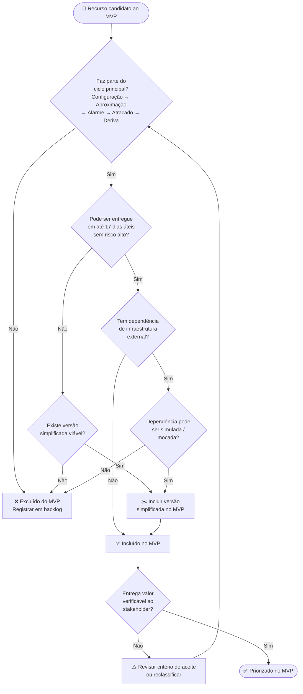
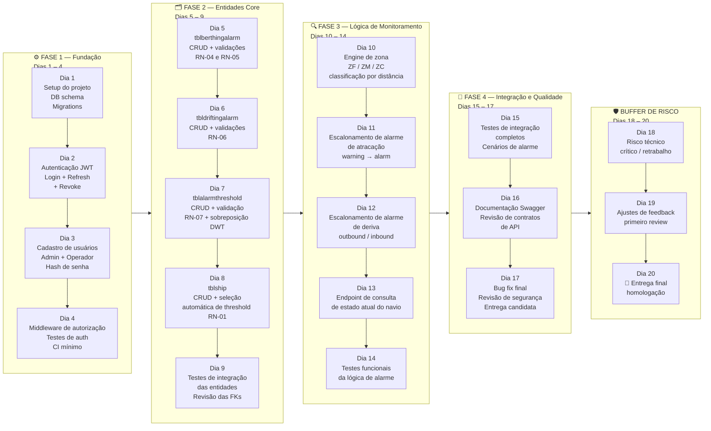
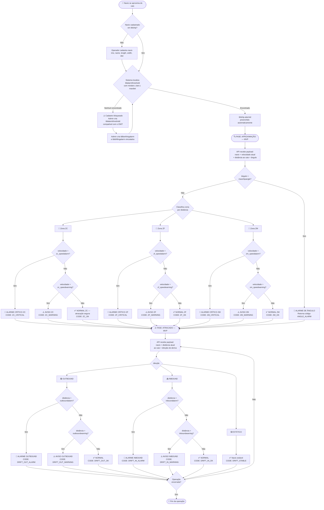

# 🚢 Sistema de Sensor de Atracação — Plano de MVP (20 dias)

> **Documento:** Planejamento de MVP  
> **Versão:** 1.0  
> **Data:** 2026-03-02  
> **Referência:** [`fluxo_sistema_atracacao.md`](./fluxo_sistema_atracacao.md) | [`modelagem_v2.md`](./modelagem_v2.md)

---

## Sumário

1. [Premissa do MVP](#1-premissa-do-mvp)
2. [Escopo: Incluso vs. Excluído](#2-escopo-incluso-vs-excluído)
3. [Fluxograma 1 — Decisão de Escopo do MVP](#3-fluxograma-1--decisão-de-escopo-do-mvp)
4. [Fluxograma 2 — Linha do Tempo de Entrega (20 dias)](#4-fluxograma-2--linha-do-tempo-de-entrega-20-dias)
5. [Fluxograma 3 — Fluxo Funcional Reduzido do MVP](#5-fluxograma-3--fluxo-funcional-reduzido-do-mvp)
6. [Fluxograma 4 — Gestão de Riscos](#6-fluxograma-4--gestão-de-riscos)
7. [Tabela de Entidades no MVP](#7-tabela-de-entidades-no-mvp)
8. [Perfis de Usuário no MVP](#8-perfis-de-usuário-no-mvp)
9. [Critérios de Aceite por Fase](#9-critérios-de-aceite-por-fase)
10. [Riscos Mapeados](#10-riscos-mapeados)

---

## 1. Premissa do MVP

O MVP tem como objetivo entregar o **núcleo operacional verificável** do sistema em até **20 dias corridos**, com buffer de risco embutido. O critério central é: *o sistema consegue detectar a aproximação de um navio cadastrado, classificar sua velocidade nas zonas ZF/ZM/ZC e emitir os devidos alertas via API?*

| Restrição | Decisão no MVP |
|---|---|
| Prazo de 20 dias (com buffer de 3 dias) | Funcionalidades de alta complexidade são diferidas |
| Equipe enxuta | Integração com dispositivos físicos (QRH) fora do escopo — simulação via payload JSON |
| Validação de hipótese | Foco no ciclo: Configuração → Aproximação → Alarme → Atracado → Deriva básica |
| Qualidade mínima entregável | Autenticação JWT, validações de negócio críticas, testes de integração das rotas principais |

---

## 2. Escopo: Incluso vs. Excluído

### ✅ Incluso no MVP

| Recurso | Entidade(s) | Justificativa |
|---|---|---|
| Autenticação JWT (login / refresh / revoke) | — | Fundamental para controle de acesso |
| Cadastro de usuários com 2 perfis: **Admin** e **Operador** | — | Hierarquia mínima funcional para demonstrar controle de acesso |
| Cadastro de navios | `tblship` | Entidade raiz; sem ela, nada funciona |
| Configuração de alarme de atracação | `tblberthingalarm` | Core do monitoramento de aproximação |
| Configuração de alarme de deriva | `tbldriftingalarm` | Core do monitoramento pós-atracação |
| Perfil de threshold por faixa de DWT | `tblalarmthreshold` | Liga navios aos parâmetros de alarme |
| Lógica de seleção automática de threshold pelo DWT | — | Regra de negócio central (RN-01) |
| Validação de zonas contíguas e limites de velocidade | — | Regras de negócio RN-04 e RN-05 |
| Monitoramento de aproximação: classificação ZF/ZM/ZC + alarme | API de leitura | Entrega o valor principal do produto |
| Monitoramento de deriva: outbound/inbound + alarme | API de leitura | Complementa o ciclo completo de operação |
| Testes de integração das rotas críticas | — | Critério mínimo de qualidade entregável |

### ❌ Excluído do MVP (versões futuras)

| Recurso | Motivo da exclusão |
|---|---|
| Padrões de amarração (`tblmooringpattern`) | Alta complexidade (48 posições de ganchos QRH); não bloqueia ciclo de monitoramento |
| Perfis **Técnico de Configuração** e **Monitor** | Simplificado para 2 perfis no MVP; expansão posterior sem quebra de contrato |
| Notificações Push em tempo real (WebSocket / SSE) | Requer infraestrutura adicional; MVP entrega via polling na API |
| Auditoria completa de logs de acesso e eventos | Diferida; base de dados pode ser preparada sem expor endpoints |
| Integração física com dispositivos QRH | Escopo de hardware; MVP simula via payload JSON |
| Dashboard / frontend | Out of scope — MVP é uma API REST documentada |
| Alertas por e-mail / SMS | Infraestrutura extra; diferida para pós-MVP |

---

## 3. Fluxograma 1 — Decisão de Escopo do MVP



---

## 4. Fluxograma 2 — Linha do Tempo de Entrega (20 dias)



---

## 5. Fluxograma 3 — Fluxo Funcional Reduzido do MVP

O fluxo abaixo representa o ciclo completo que o MVP suporta — sem padrões de amarração e com perfis de usuário simplificados.



---

## 6. Fluxograma 4 — Gestão de Riscos

```mermaid
flowchart TD
    A([🚦 Risco identificado\ndurante o desenvolvimento]) --> B{Severidade\ndo risco}

    B --> ALTO[🔴 ALTO\nBloqueia entrega\nou corromperia dados]
    B --> MEDIO[🟡 MÉDIO\nAtraso de 1–2 dias\nem feature específica]
    B --> BAIXO[🟢 BAIXO\nImpacto cosmético\nou de documentação]

    ALTO --> A1{Ocorreu nas\nFases 1 ou 2?}
    A1 -- Sim --> A2[🛑 Usar buffer Dia 18\nReavaliar escopo\nse necessário]
    A1 -- Não --> A3[🛑 Usar buffer Dia 18–19\nReduzir escopo da Fase 4\nse necessário]

    MEDIO --> M1{Fase de ocorrência}
    M1 -- Fase 1/2 --> M2[⚠️ Absorver no próprio dia\nou usar 1 dia do buffer]
    M1 -- Fase 3/4 --> M3[⚠️ Usar 1 dia do buffer\nDia 18 ou 19]

    BAIXO --> L1[📋 Registrar no backlog\nNão consome buffer]

    A2 & A3 --> CUT{Risco esgotou\nbuffer inteiro?}
    M2 & M3 --> CUT

    CUT -- Sim --> CUT2[🔪 Decisão de corte de escopo\npor prioridade:\n1º mooringpattern já excluído\n2º deriva simplificada\n3º perfis extras]
    CUT -- Não --> OK[✅ Buffer consumido\nEntrega mantida no Dia 20]

    CUT2 --> NEG[📢 Comunicar stakeholder\ncom escopo revisado\ne data mantida]
    OK --> FIM([🏁 Entrega no Dia 20])
    NEG --> FIM

    subgraph RISCOS_MAPEADOS["📋 Riscos Pré-mapeados"]
        R1[R1 — Complexidade da\nlógica de zonas ZF/ZM/ZC\nPROB: Média | SEVERIDADE: Alto]
        R2[R2 — Sobreposição de faixas\nDWT em tblalarmthreshold\nPROB: Baixa | SEVERIDADE: Médio]
        R3[R3 — Ambiguidade nos\ncontratos de payload\ndo sensor físico\nPROB: Alta | SEVERIDADE: Médio]
        R4[R4 — Retrabalho por\nfeedback de stakeholder\nno review do Dia 19\nPROB: Média | SEVERIDADE: Médio]
        R5[R5 — Falha de CI/CD\nou ambiente de deploy\nPROB: Baixa | SEVERIDADE: Alto]
    end
```

---

## 7. Tabela de Entidades no MVP

| Entidade | Status no MVP | Operações disponíveis | O que é diferido |
|---|:---:|---|---|
| `tblship` | ✅ Completo | GET, POST, PUT, DELETE (Admin) | — |
| `tblberthingalarm` | ✅ Completo | GET, POST, PUT, DELETE (Admin) | — |
| `tbldriftingalarm` | ✅ Completo | GET, POST, PUT, DELETE (Admin) | — |
| `tblalarmthreshold` | ✅ Completo | GET, POST, PUT, DELETE (Admin) | Alerta de sobreposição de DWT (v1.1) |
| `tblmooringpattern` | ❌ Excluído | — | Integridade completa com QRH na v1.1 |
| Usuários | ✅ Simplificado | GET, POST, PUT, DELETE | Perfis Técnico e Monitor na v1.1 |

---

## 8. Perfis de Usuário no MVP

O MVP reduz os 4 perfis do sistema completo para **2 perfis essenciais**, suficientes para validar o controle de acesso e operar o ciclo principal.

| Perfil MVP | Equivalência no sistema completo | Permissões no MVP |
|---|---|---|
| 🔒 **Admin** | Administrador | CRUD completo em todas as entidades do MVP + gestão de usuários |
| 🏗️ **Operador** | Operador Portuário + Técnico de Configuração (unificados) | CRUD em `tblship`, `tblberthingalarm`, `tbldriftingalarm`, `tblalarmthreshold`. Sem gestão de usuários |

> **Nota de migração:** Os perfis foram unificados para reduzir complexidade de desenvolvimento. A separação em 4 perfis (com Técnico e Monitor) será implementada na v1.1, adicionando apenas novos `claim roles` ao JWT sem alterar os contratos de API existentes.

---

## 9. Critérios de Aceite por Fase

### Fase 1 — Fundação (Dias 1–4)
- [ ] Login retorna JWT válido com `role` no claim
- [ ] Refresh token rotaciona corretamente
- [ ] Rota protegida retorna `401` com token inválido e `403` com role insuficiente
- [ ] Usuário Admin criado via seed do banco na inicialização

### Fase 2 — Entidades Core (Dias 5–9)
- [ ] `POST /berthingalarm` rejeita com `400` se `speedwarning ≥ speedalarm` (qualquer zona)
- [ ] `POST /berthingalarm` rejeita com `400` se zonas não forem contíguas
- [ ] `POST /driftingalarm` rejeita com `400` se `outboundwarning ≥ outboundalarm` ou `inboundwarning ≥ inboundalarm`
- [ ] `POST /alarmthreshold` rejeita com `400` se `mindwt ≥ maxdwt`
- [ ] `POST /ship` preenche `alarmid` automaticamente pelo DWT; retorna `422` se nenhum threshold for compatível
- [ ] Todas as FKs respeitam `ON DELETE RESTRICT` — tentativa de exclusão de entidade referenciada retorna `409`

### Fase 3 — Lógica de Monitoramento (Dias 10–14)
- [ ] `POST /monitoring/approach` com distância na faixa ZF + velocidade > `zf_speedalarm` retorna `ZF_CRITICAL`
- [ ] `POST /monitoring/approach` com ângulo > `maxshipangle` retorna `ANGLE_ALARM` independente da zona
- [ ] `POST /monitoring/drift` com direção `OUTBOUND` e distância > `outboundalarm` retorna `DRIFT_OUT_ALARM`
- [ ] `POST /monitoring/drift` com direção `STATIC` retorna `DRIFT_STABLE`
- [ ] Todos os cenários de zona (ZF/ZM/ZC) × (OK/WARNING/CRITICAL) cobertos por testes

### Fase 4 — Integração e Qualidade (Dias 15–17)
- [ ] Cobertura de testes de integração ≥ 80% nas rotas críticas
- [ ] Swagger/OpenAPI gerado e acessível em `/swagger`
- [ ] Nenhum endpoint retorna `500` nos cenários de teste documentados
- [ ] README com instruções de execução local e exemplos de payload

---

## 10. Riscos Mapeados

| ID | Risco | Probabilidade | Severidade | Mitigação | Dias de buffer |
|---|---|:---:|:---:|---|:---:|
| R1 | Complexidade da lógica de classificação de zonas ZF/ZM/ZC com edge cases de distância exata nos limites | Média | 🔴 Alto | Implementar unit tests já no Dia 10; validar com 3 cenários limite por zona | 1–2 dias |
| R2 | Sobreposição de faixas DWT em `tblalarmthreshold` gera ambiguidade na seleção automática | Baixa | 🟡 Médio | Adicionar constraint de unicidade no banco no Dia 7; alerta na criação via validação de negócio | < 1 dia |
| R3 | Contrato de payload do sensor físico indefinido — integração com hardware adiada | Alta | 🟡 Médio | MVP define e documenta o contrato de API; hardware simula via Postman/curl no período de testes | Não consome buffer |
| R4 | Retrabalho após review de stakeholder no Dia 19 | Média | 🟡 Médio | Alinhar expectativas no início e ao final da Fase 2 (checkpoint no Dia 9) | 1 dia |
| R5 | Falha de ambiente de deploy / CI-CD | Baixa | 🔴 Alto | Manter deploy local funcional como fallback; configurar pipeline simples no Dia 1 | 1 dia |

**Total de buffer reservado:** 3 dias (Dias 18–20)  
**Consumo máximo mapeado:** 2 dias (R1 + R5 no pior caso)  
**Margem restante:** 1 dia de segurança na data de entrega final (Dia 20)

---

> **Versão:** 1.0 | **Criado em:** 2026-03-02 | **Referência:** [`fluxo_sistema_atracacao.md`](./fluxo_sistema_atracacao.md)