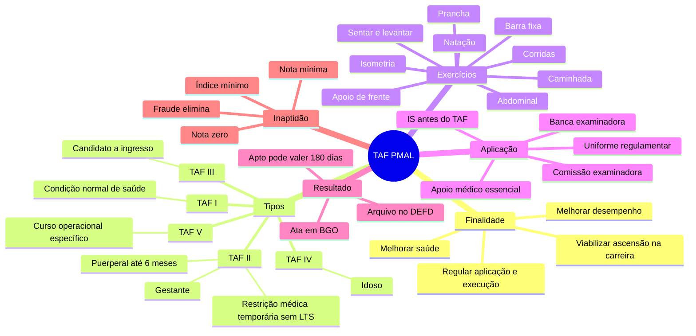
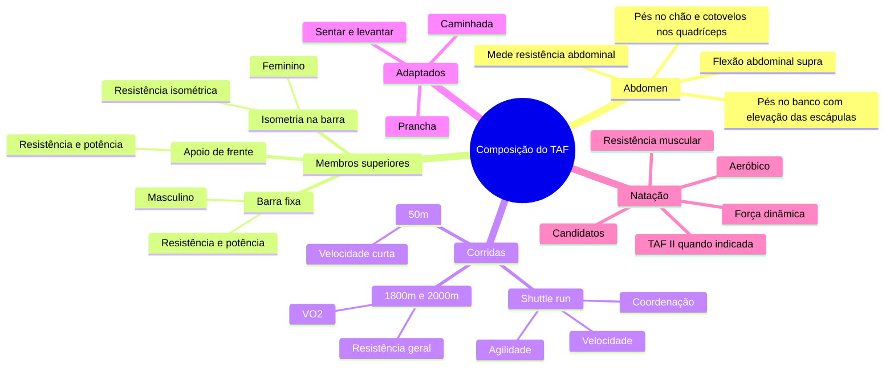
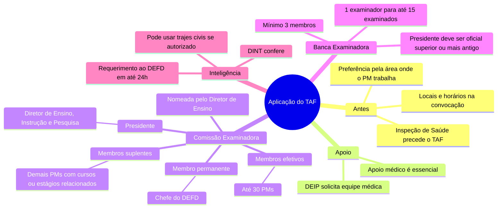
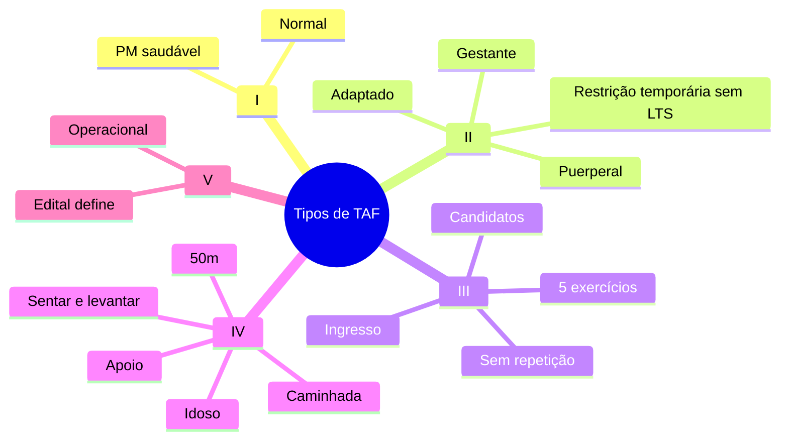
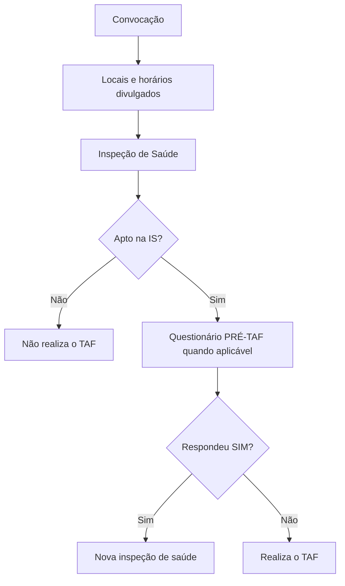
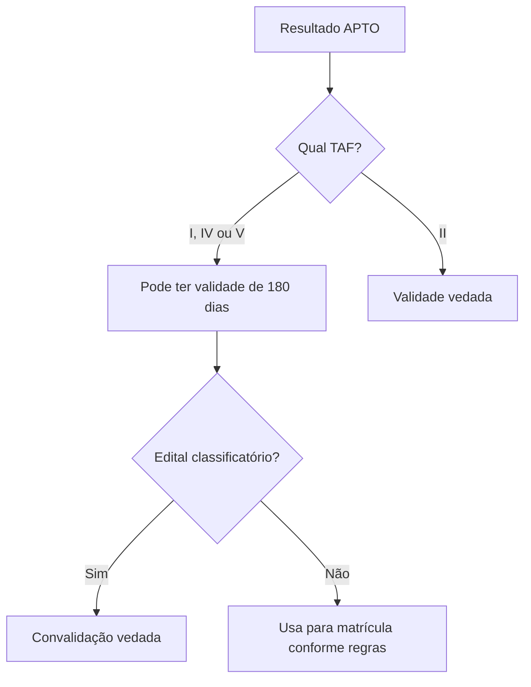

# Resumos, mapas mentais e mecanismos de memorização - Portaria do TAF/PMAL

Material criado a partir do arquivo `mapa_mental_portaria.md`, sobre as Normas Reguladoras do Teste de Aptidão Física da Polícia Militar do Estado de Alagoas.

Observação importante: o arquivo-base cita anexos C, D, E, F e G, mas o conteúdo desses anexos não aparece no texto fornecido. O Anexo A aparece apenas parcialmente, até a indicação da 2ª etapa de resistência aeróbica. Portanto, este material cobre o conteúdo disponível no arquivo.

---

## 1. Visão geral em 1 página

A Portaria regula a aplicação e execução do Teste de Aptidão Física (TAF) na PMAL. A finalidade é melhorar a saúde do militar, aumentar o desempenho nas atividades da Corporação e permitir ascensão na carreira.

O TAF é dividido em 5 tipos:

| Tipo | Para quem serve | Ideia-chave |
|---|---|---|
| TAF I | Policiais militares em condições normais de saúde | TAF padrão |
| TAF II | Gestantes, puerperais até 6 meses ou militares com restrição médica temporária, sem LTS | TAF adaptado |
| TAF III | Candidatos a ingresso na Corporação | TAF de entrada |
| TAF IV | Policiais militares idosos, conforme Estatuto do Idoso | TAF para idoso |
| TAF V | Cursos operacionais específicos, dentro ou fora da Corporação | TAF conforme edital |

Os exercícios previstos na Portaria são:

| Exercício | O que avalia ou quando aparece |
|---|---|
| Flexão abdominal supra | Resistência da musculatura abdominal |
| Tração sob a barra fixa | Resistência e potência de membros superiores e cintura escapular, masculino |
| Apoio de frente sobre o solo | Resistência e potência de membros superiores e cintura escapular |
| Isometria sobre a barra fixa | Resistência muscular isométrica de membros superiores e cintura escapular, feminino |
| Shuttle run | Velocidade, agilidade e coordenação motora |
| Corrida 1.800m ou 2.000m | Resistência geral e consumo máximo de oxigênio |
| Corrida 50m | Velocidade em curta distância |
| Natação 50m | Capacidade aeróbica, resistência muscular localizada e força dinâmica |
| Caminhada | Gestantes, puerperais ou restrição médica |
| Sentar e levantar | Restrição médica temporária |
| Prancha abdominal | Restrição médica temporária |

Frase-resumo:

> O TAF mede força, resistência, velocidade, agilidade e condição aeróbica, adaptando a exigência conforme saúde, idade, ingresso, curso ou condição especial.

---

## 2. Mapa mental mestre

---

## 3. Mnemônico dos 5 TAFs

Use a frase:

> **Normal, Adaptado, Ingresso, Idoso, Operacional.**

Equivalência:

| Número | Mnemônico | TAF |
|---|---|---|
| I | Normal | PM em condição normal de saúde |
| II | Adaptado | Gestante, puerperal ou restrição médica |
| III | Ingresso | Candidato a entrar na Corporação |
| IV | Idoso | PM idoso |
| V | Operacional | Cursos operacionais específicos |

Macete:

> **1 normal, 2 adaptado, 3 entrada, 4 idade, 5 operação.**

---

## 4. Resumo por capítulo

### Capítulo I - Finalidade

O objetivo da norma é regular a aplicação e execução do TAF na PMAL.

Pontos de prova:

- Melhoria das condições de saúde de cada militar.
- Melhor desempenho nas atividades da Corporação.
- Ascensão na carreira profissional.

Pergunta provável:

> A Portaria trata só de seleção para curso?

Resposta: não. Ela regula o TAF de forma ampla, incluindo saúde, desempenho institucional e ascensão na carreira.

---

### Capítulo II - Tipos de TAF

| TAF | Destinatário | Detalhe que costuma cair |
|---|---|---|
| TAF I | PM em condição normal de saúde | É o padrão |
| TAF II | Gestante, puerperal até 6 meses ou restrição médica temporária sem LTS | Uso limitado, com finalidade específica |
| TAF III | Candidato a ingresso | Não permite repetição nem substituição |
| TAF IV | PM idoso | Conforme Estatuto do Idoso |
| TAF V | Curso operacional | Exercícios e índices vêm do edital |

Regra especial do TAF II:

- É usado exclusivamente para matrícula em curso obrigatório de ascensão na carreira ou ingresso em quadro de acesso para promoção.
- É vedado realizar por mais de 1 vez consecutiva para a mesma finalidade.
- Exceção: limitação funcional permanente comprovada por junta médica da Corporação.

Cursos citados para ascensão:

| Sigla | Como aparece no texto |
|---|---|
| CCEM | Curso obrigatório para ascensão |
| CAO | Curso obrigatório para ascensão |
| CHOS | Curso obrigatório para ascensão |
| CHOE | Curso obrigatório para ascensão |
| CAP | Curso obrigatório para ascensão |
| CFS | Curso obrigatório para ascensão |

---

### Capítulo III - Composição e fundamentos

Mapa mental dos exercícios:

Mnemônico dos exercícios:

> **A-B-A-I-C-N-C-S-P**

Como decorar:

- **A**bdominal
- **B**arra fixa
- **A**poio de frente
- **I**sometria
- **C**orridas
- **N**atação
- **C**aminhada
- **S**entar e levantar
- **P**rancha

Frase:

> **A Boa Aptidão Inclui Corrida, Natação, Caminhada, Sentar e Prancha.**

---

## 5. TAF I - Padrão para PM em condição normal

### Quem faz

Policial militar em condições normais de saúde.

### Divisão por sexo e idade

| Público | Menos de 31 anos | A partir de 31 anos |
|---|---|---|
| Masculino | Abdominal no solo, barra fixa, shuttle run, corrida 2.000m | Abdominal no solo ou banco, barra fixa ou apoio de frente, shuttle run, corrida 2.000m |
| Feminino | Abdominal no solo, isometria na barra, shuttle run, corrida 1.800m | Abdominal no solo ou banco, apoio de frente ou isometria na barra, shuttle run, corrida 1.800m |

Macete:

> Antes dos 31, a prova é mais fechada. A partir dos 31, aparecem opções/substituições no abdominal e no exercício de membros superiores.

### Etapas

| Etapa | O que mede | Intervalo |
|---|---|---|
| 1ª etapa | Resistência anaeróbica | Feita primeiro |
| 2ª etapa | Resistência aeróbica | Após 24h |

Regras de tempo:

- Regra geral: duas etapas com intervalo de 24h.
- Se faltar ao primeiro dia por motivo justificado, pode fazer tudo no segundo dia.
- É facultado fazer as duas etapas no mesmo dia, se houver interesse do PM.
- Se fizer no mesmo dia, deve haver intervalo de 30 minutos entre as etapas.
- Dentro da mesma etapa, o intervalo entre exercícios deve ser de pelo menos 5 minutos.

### Reteste e substituição no TAF I

Corrida 1.800m ou 2.000m:

- Se não atingir índice mínimo do Anexo C, tem direito a repetir.
- No reteste, se ultrapassar o tempo limite da pontuação 0,25 por 1 segundo até 1 minuto, recebe pontuação 0,125.

Resistência anaeróbica:

- Se não atingir índices mínimos do Anexo C, pode repetir ou substituir uma única vez o exercício de menor pontuação.
- A pontuação obtida será 0,125.

Substituições:

| Sexo | Substituição possível |
|---|---|
| Masculino | Barra fixa por isometria na barra |
| Masculino | Abdominal pés no solo por abdominal na cadeira |
| Masculino | Shuttle run por corrida de 50m |
| Feminino | Isometria na barra fixa por apoio de frente |
| Feminino | Abdominal pés no solo por abdominal na cadeira |
| Feminino | Shuttle run por corrida de 50m |

---

## 6. TAF II - Adaptado

### Quem faz

| Situação | Exercício-base |
|---|---|
| Policial militar gestante | Caminhada |
| Policial militar em estado puerperal, até 6 meses após o parto | Caminhada |
| PM com restrição médica temporária, sem LTS | Caminhada + 3 exercícios do TAF I ou da lista indicada por Junta Médica |

Exigências para restrição médica:

- O militar não pode estar de Licença para Tratamento de Saúde (LTS).
- A restrição deve decorrer de ferimentos, cirurgia, doença clínica com limitação funcional ou acidente.
- Deve haver comprovação por laudo médico especializado e exame complementar.
- A escolha dos exercícios depende da Junta Médica da Corporação.

### Exercícios que a Junta Médica pode indicar

Mnemônico:

> **A-Se-Co-Pra-Na**

| Letra | Exercício |
|---|---|
| A | Apoio de frente sobre o solo, 6 apoios |
| Se | Sentar e levantar |
| Co | Corrida de 50m |
| Pra | Prancha abdominal |
| Na | Natação 50m |

Regras:

- Realizado em um único dia.
- Intervalo mínimo de 5 minutos entre exercícios dentro da mesma etapa.
- Segue tabela do Anexo E, que é citado mas não aparece no arquivo.

---

## 7. TAF III - Candidatos a ingresso

### Estrutura

| Item | Regra |
|---|---|
| Quantidade de exercícios | 5 |
| Quantidade de etapas | 2 |
| Intervalo entre etapas | Mínimo de 48h |
| Substituição/repetição | Não é permitida |

### Etapas

| Etapa | Exercícios |
|---|---|
| 1ª etapa | Abdominal supra, barra fixa ou isometria, shuttle run, corrida |
| 2ª etapa | Natação |

### Índices mínimos do TAF III

| Sexo | Abdominal | Barra/Isometria | Shuttle run | Corrida | Natação 50m |
|---|---:|---:|---:|---:|---:|
| Masculino | 40 repetições | 4 repetições na barra | 11 segundos | 2.000m em 11 minutos | 50 segundos |
| Feminino | 30 repetições | 10 segundos de isometria | 13 segundos | 1.800m em 13 minutos | 60 segundos |

Macete dos números:

> Masculino: **40 - 4 - 11 - 11 - 50**  
> Feminino: **30 - 10 - 13 - 13 - 60**

Leitura para decorar:

- Homem: 40 abdominais, 4 barras, 11 no shuttle, 11 na corrida, 50 na natação.
- Mulher: 30 abdominais, 10 segundos na isometria, 13 no shuttle, 13 na corrida, 60 na natação.

---

## 8. TAF IV - Idosos

Quem faz:

- Policiais militares considerados idosos conforme o Estatuto do Idoso.

Exercícios:

| Ordem de memorização | Exercício |
|---|---|
| 1 | Caminhada |
| 2 | Sentar e levantar |
| 3 | Corrida de 50m |
| 4 | Apoio de frente |

Mnemônico:

> **Ca-Se-Co-Apo**

Regras:

- Realizado em um único dia.
- Intervalo mínimo de 5 minutos entre exercícios.
- Falta justificada: deve solicitar ao Subcomandante Geral nova data estabelecida pelo DEFD.
- Não permite substituição ou repetição de exercícios.

---

## 9. TAF V - Cursos operacionais

O TAF V é definido pelo edital de abertura dos cursos operacionais disponibilizados na PMAL ou fora da Corporação.

Ponto de prova:

> No TAF V, não se decora uma lista fixa na Portaria: exercícios e índices dependem do edital.

---

## 10. Procedimentos para aplicação do TAF

Mapa mental:

### Comissão Examinadora

| Função | Quem é |
|---|---|
| Presidente | Diretor de Ensino, Instrução e Pesquisa |
| Membro permanente | Chefe do DEFD |
| Membros efetivos | Até 30 PMs da ativa ou reserva remunerada com cursos ligados à Educação Física |
| Membros suplentes | Demais PMs com cursos ou estágios militares ligados à Educação Física |

### Banca Examinadora

| Regra | Conteúdo |
|---|---|
| Composição mínima | 3 membros |
| Origem | Escolhidos entre integrantes da Comissão Examinadora |
| Proporção | 1 examinador para no máximo 15 examinados |
| Presidência | Oficial de posto superior ou mais antigo que os examinados |
| Falta de oficial superior/mais antigo | Designação extraordinária pelo Subcomandante Geral |

### Serviço de inteligência e traje civil

Fluxo:

1. Após publicação do chamamento, o militar de inteligência requer ao DEFD em até 24h a realização em trajes civis.
2. O DEFD encaminha a demanda à DINT.
3. A DINT analisa em até 24h se o militar está efetivamente em operação de inteligência.
4. Se estiver autorizado, o TAF ocorre em dias específicos estabelecidos pelo DEFD.
5. Se não estiver em operação de inteligência, aplica-se a regra geral do uniforme.
6. Somente o Comando Geral pode autorizar traje civil por motivo diverso.

Consequência:

- Militar sem autorização para traje civil será impedido de realizar o TAF.
- Também pode responder a procedimento disciplinar.

---

## 11. Resultado do TAF

### Validade do APTO

| Regra | Conteúdo |
|---|---|
| Prazo de validade | 180 dias |
| Finalidade | Matrícula em curso obrigatório para ascensão e cursos não operacionais |
| Condição | Não ter alteração de saúde desde a inspeção |
| Comprovação | Questionário de avaliação PRÉ-TAF da PMAL |
| TAFs que admitem validade | TAF I, TAF IV e TAF V |
| Vedado para | TAF II |

Ponto fino:

- A convalidação é vedada quando o edital do curso trouxer o TAF como etapa classificatória.

### Ata de resultado

A ata deve:

- Ser assinada pelo presidente da comissão.
- Ser assinada pelos membros da banca examinadora.
- Ser publicada em BGO.
- Ser arquivada no DEFD.

Deve constar:

- Finalidade do TAF.
- Data.
- Posto ou graduação.
- Nome completo.
- Idade.
- Índices alcançados.
- Notas respectivas.
- Somatório de pontos.
- Conceito do examinado.

Mnemônico da ata:

> **Fi-Da-Po-No-I-I-No-So-Co**

Leitura:

> Finalidade, Data, Posto, Nome, Idade, Índices, Notas, Somatório e Conceito.

---

## 12. Antecipação, adiamento e remarcação

Quando é possível:

- Extraordinariamente.
- Em situações ligadas à composição de quadro de acesso.
- Em situações ligadas à matrícula em curso obrigatório para ascensão.
- Mediante requerimento do policial militar.

Regras:

| Tema | Regra |
|---|---|
| Destino do requerimento | Subcomandante Geral |
| Conteúdo | Fundamentação da impossibilidade de comparecer nos dias marcados |
| Prazo de solução | 48h |
| Limite | Não pode interferir nos prazos de promoção ou início do curso |

Macete:

> Remarcar pode, bagunçar prazo de promoção ou curso não pode.

---

## 13. PM em missão oficial fora do Estado ou do País

A inspeção de saúde e o TAF podem ser realizados em outro estado ou país quando o PM estiver em missão oficial do Estado de Alagoas.

Finalidades:

- Promoção.
- Avaliação física periódica.
- Matrícula em curso obrigatório.

Regras:

| Tema | Regra |
|---|---|
| Requerimento | Ao Subcomandante Geral |
| Antecedência | Pelo menos 10 dias antes da realização do exame |
| Solução | Até 48h |
| Supervisão | Policiais militares ou militares das Forças Armadas |
| Envio dos resultados | Até a data limite de promoções ou início do curso |

Mnemônico:

> **10 antes, 48 decide, militar supervisiona, prazo final manda.**

---

## 14. Uniforme

Regra geral:

- O TAF deve ser realizado com uniforme de Educação Física Regulamentar da Corporação.
- É vedado apresentar-se com uniforme alterado.
- É vedado apresentar-se com tênis diverso da cor preta.

Exceção:

- Durante a realização dos exercícios, é facultado usar tênis apropriado ao exercício, sem distinção de modelo e cor.

Ponto de prova:

> Apresentação para o TAF exige tênis preto; execução dos exercícios permite tênis apropriado, sem restrição de cor/modelo.

---

## 15. TAF em Unidades de Ensino

O TAF nas Unidades de Ensino:

- É obrigatório como critério de avaliação nos cursos de formação.
- Tem valoração condicionada às normas próprias das OPMs.
- Não permite substituição de exercícios.

---

## 16. Inaptidão

| TAF | Quando fica inapto |
|---|---|
| TAF I | Não atingir 20 pontos ou média 5,0 no cômputo geral, ou tirar 0,0 em qualquer exercício |
| TAF II | Não atingir nota mínima 5,0 nos exercícios, ou tirar 0,0 em qualquer exercício |
| TAF III | Não atingir os índices mínimos exigidos |
| TAF IV | Não atingir nota mínima 5,0 nos exercícios, ou tirar 0,0 em qualquer exercício |
| TAF V | Não atingir índices mínimos do edital do curso operacional |

Mnemônico:

> **I, II e IV olham nota; III e V olham índice.**

Com detalhe:

- TAF I: 20 pontos ou média 5,0, e nenhum zero.
- TAF II: nota mínima 5,0, e nenhum zero.
- TAF IV: nota mínima 5,0, e nenhum zero.
- TAF III: índices mínimos.
- TAF V: índices mínimos do edital.

---

## 17. Disposições finais

Pontos essenciais:

- TAFs de CCEM, CAO, CFO, CHOS, CHOE, CAP, CFS e CFP serão definidos nos Planos de Cursos.
- Esses TAFs devem servir como critério de avaliação nas ementas de TFM ou disciplina congênere.
- PMs do Tenente Coronel ao Soldado devem realizar no mínimo 2 TAFs por ano, um por semestre.
- Para quadro de acesso à promoção, o TAF semestral segue as datas previstas nas leis de promoção e decretos de regulamentação, conforme convocação do setor de promoção.
- Para os demais militares, como avaliação física periódica, o TAF ocorre de março a junho no primeiro semestre e de setembro a dezembro no segundo semestre.
- Para avaliação física periódica, o militar precisa estar apto em inspeção de saúde feita nos últimos 12 meses e sem alteração de saúde desde então.
- Se responder "SIM" a uma ou mais perguntas do questionário PRÉ-TAF, só faz o TAF após novo resultado de aptidão em inspeção de saúde.
- Militar inapto na Inspeção de Saúde por falta de condição para esforço físico não pode realizar o TAF.
- Fraude, ajuda de terceiros ou ato que prejudique a organização/realização do TAF elimina o militar e pode gerar sanção disciplinar.
- Os TAFs podem ser filmados quando houver equipamento disponível e interesse da comissão, como avaliação e prova futura.
- Casos omissos são resolvidos pelo Comandante Geral após consulta aos órgãos competentes.
- A Portaria entra em vigor na data de publicação.

---

## 18. Anexo A disponível no arquivo

O arquivo traz apenas o início do Anexo A, sobre o TAF I.

### 1ª etapa - Resistência anaeróbica

| Idade | Masculino | Feminino |
|---|---|---|
| Menos de 31 anos | Abdominal supra tocando cotovelos nos quadríceps; tração sob a barra fixa | Abdominal supra tocando cotovelos nos quadríceps; isometria sobre a barra fixa |
| A partir de 31 anos | Abdominal supra com elevação das escápulas ou tocando cotovelos nos quadríceps; apoio de frente ou tração sob a barra fixa | Abdominal supra com elevação das escápulas ou tocando cotovelos nos quadríceps; apoio de frente ou isometria sobre a barra fixa |
| Todas as idades | Shuttle run | Shuttle run |

### 2ª etapa - Resistência aeróbica

O arquivo menciona o título da 2ª etapa, mas não traz a continuação da tabela.

Pelo corpo da Portaria, a corrida aeróbica do TAF I é:

- Masculino: 2.000m.
- Feminino: 1.800m.

---

## 19. Tabela dos prazos e números para decorar

| Número | O que significa |
|---:|---|
| 5 tipos | TAF I a TAF V |
| 5 minutos | Intervalo mínimo entre exercícios dentro da mesma etapa |
| 24h | Intervalo entre etapas do TAF I |
| 30 minutos | Intervalo se as duas etapas do TAF I forem feitas no mesmo dia |
| 48h | Intervalo mínimo entre etapas do TAF III |
| 48h | Solução de requerimento de antecipação, adiamento ou remarcação |
| 48h | Solução do requerimento para IS/TAF fora do Estado ou País |
| 10 dias | Antecedência para requerer IS/TAF em missão fora do Estado ou País |
| 180 dias | Validade do APTO para TAF I, IV e V, nas hipóteses permitidas |
| 12 meses | Validade da inspeção de saúde para avaliação física periódica |
| 2 TAFs por ano | Mínimo anual do Tenente Coronel ao Soldado |
| 1 por semestre | Distribuição mínima anual |
| 3 membros | Mínimo da banca examinadora |
| 1 para 15 | Proporção examinador/examinados |
| 30 membros | Máximo de membros efetivos da Comissão Examinadora |
| 6 meses | Puerpério considerado para TAF II |

Mnemônico dos prazos:

> **5 respira, 24 separa, 30 junta, 48 decide, 10 antecipa, 180 aproveita, 12 valida.**

Tradução:

- 5 minutos entre exercícios.
- 24h entre etapas do TAF I.
- 30 minutos se juntar as etapas do TAF I no mesmo dia.
- 48h para decisões de requerimento e intervalo do TAF III.
- 10 dias para pedir IS/TAF fora do Estado ou País.
- 180 dias de validade do APTO.
- 12 meses para inspeção de saúde periódica.

---

## 20. Mapas mentais por tema

### Tipos de TAF

### Fluxo antes do TAF

### Resultado e validade

---

## 21. Pegadinhas prováveis de prova

1. TAF II não é "para qualquer restrição médica"; a Portaria fala em gestante, puerperal até 6 meses ou restrição médica temporária sem LTS, comprovada e com limitação funcional.
2. TAF II não pode ser usado indefinidamente para a mesma finalidade; é vedado por mais de 1 vez consecutiva, salvo limitação funcional permanente comprovada por junta médica.
3. TAF III não permite substituição nem repetição de exercícios.
4. TAF IV também não permite substituição nem repetição.
5. TAF V não tem índice fixo na Portaria; depende do edital do curso operacional.
6. Inspeção de Saúde vem antes do TAF.
7. Apoio médico é essencial na aplicação do TAF.
8. O APTO de 180 dias não vale para TAF II.
9. Se o edital tratar o TAF como etapa classificatória, não há convalidação.
10. Uniforme regulamentar e tênis preto são regra de apresentação, mas durante os exercícios pode-se usar tênis apropriado sem distinção de cor/modelo.
11. A banca tem mínimo de 3 membros e proporção de 1 examinador para até 15 examinados.
12. O militar de inteligência não escolhe simplesmente fazer em traje civil; precisa de trâmite DEFD/DINT e autorização.
13. Responder "SIM" no PRÉ-TAF impede a realização imediata e exige nova aptidão em inspeção de saúde.
14. Fraude, ajuda de terceiro ou ato que atrapalhe a organização elimina do TAF e pode gerar sanção disciplinar.

---

## 22. Flashcards de revisão ativa

Use estes cartões cobrindo a resposta com a mão ou usando revisão espaçada.

| Pergunta | Resposta |
|---|---|
| Qual a finalidade da Portaria do TAF? | Regular aplicação e execução do TAF na PMAL, buscando saúde, desempenho e ascensão na carreira. |
| Quantos tipos de TAF existem? | Cinco: TAF I, II, III, IV e V. |
| Para quem é o TAF I? | PM em condições normais de saúde. |
| Para quem é o TAF II? | Gestantes, puerperais até 6 meses ou militares com restrição médica temporária sem LTS. |
| Para quem é o TAF III? | Candidatos a ingresso na Corporação. |
| Para quem é o TAF IV? | Policiais militares idosos. |
| Para quem é o TAF V? | Cursos operacionais específicos. |
| O TAF II pode ser repetido várias vezes consecutivas para a mesma finalidade? | Não, salvo limitação funcional permanente comprovada por junta médica. |
| Quem aprova normas de TAF para cursos de especialização com condicionamento específico? | Departamento de Educação Física da Corporação. |
| O que mede o shuttle run? | Velocidade, agilidade e coordenação motora. |
| O que medem as corridas de 1.800m e 2.000m? | Resistência geral e consumo máximo de oxigênio. |
| O que mede a corrida de 50m? | Velocidade de deslocamento em curta distância. |
| Qual corrida aeróbica do masculino no TAF I? | 2.000m. |
| Qual corrida aeróbica do feminino no TAF I? | 1.800m. |
| Qual intervalo normal entre etapas do TAF I? | 24h. |
| Se o TAF I for feito em um único dia, qual intervalo entre etapas? | 30 minutos. |
| Qual intervalo mínimo entre exercícios na mesma etapa? | 5 minutos. |
| No TAF I, pode repetir corrida se não atingir índice mínimo? | Sim. |
| No TAF III, há repetição ou substituição? | Não. |
| Quantas etapas tem o TAF III? | Duas. |
| Qual intervalo mínimo entre etapas do TAF III? | 48h. |
| Qual a segunda etapa do TAF III? | Natação. |
| Índices masculinos do TAF III? | 40 abdominais, 4 barras, 11s shuttle, 2.000m em 11min, natação 50m em 50s. |
| Índices femininos do TAF III? | 30 abdominais, 10s isometria, 13s shuttle, 1.800m em 13min, natação 50m em 60s. |
| Quais exercícios do TAF IV? | Caminhada, sentar e levantar, corrida de 50m e apoio de frente. |
| Quem define exercícios e índices do TAF V? | O edital do curso operacional. |
| O que precede a realização do TAF? | Inspeção de Saúde. |
| Quem nomeia a Comissão Examinadora? | Diretor de Ensino, Instrução e Pesquisa. |
| Quem é o membro permanente da Comissão Examinadora? | Chefe do DEFD. |
| Qual a composição mínima da banca? | 3 membros. |
| Qual a proporção examinador/examinados? | 1 examinador para até 15 examinados. |
| Quem autoriza traje civil por motivo diverso dos previstos? | Comando Geral. |
| Qual a validade do resultado APTO? | 180 dias, para hipóteses permitidas. |
| A validade de 180 dias vale para TAF II? | Não. |
| Onde a ata é publicada? | Em BGO. |
| Onde a ata é arquivada? | No DEFD. |
| Qual o prazo de solução para requerimento de remarcação? | 48h. |
| Qual antecedência para requerer IS/TAF em missão oficial fora do Estado ou País? | Pelo menos 10 dias. |
| Qual uniforme é obrigatório? | Uniforme de Educação Física Regulamentar da Corporação. |
| O TAF em Unidade de Ensino permite substituição de exercícios? | Não. |
| Quando há inaptidão no TAF I? | Menos de 20 pontos ou média inferior a 5,0, ou nota zero em qualquer exercício. |
| Quando há inaptidão no TAF II? | Nota menor que 5,0 ou nota zero em qualquer exercício. |
| Quando há inaptidão no TAF III? | Não atingir os índices mínimos. |
| Quando há inaptidão no TAF IV? | Nota menor que 5,0 ou nota zero em qualquer exercício. |
| Quando há inaptidão no TAF V? | Não atingir os índices mínimos do edital. |
| Quantos TAFs anuais deve realizar o PM do Ten Cel ao Soldado? | No mínimo 2, um por semestre. |
| Qual período do TAF periódico no primeiro semestre? | Março a junho. |
| Qual período do TAF periódico no segundo semestre? | Setembro a dezembro. |
| Qual validade da inspeção de saúde para avaliação física periódica? | Últimos 12 meses, sem alteração de saúde. |
| O que ocorre se responder SIM no PRÉ-TAF? | Só realiza TAF após novo resultado de aptidão em inspeção de saúde. |
| O que acontece em caso de fraude ou ajuda de terceiro? | Eliminação do TAF e possível sanção disciplinar. |

---

## 23. Questões rápidas no estilo "certo ou errado"

1. O TAF II é utilizado para candidatos a ingresso na Corporação.  
Resposta: errado. Isso é TAF III.

2. O TAF V tem exercícios e índices definidos no edital do curso operacional.  
Resposta: certo.

3. A Inspeção de Saúde deve ocorrer antes do TAF.  
Resposta: certo.

4. O TAF III permite substituição de exercícios em caso de baixo desempenho.  
Resposta: errado.

5. A banca examinadora deve ter no mínimo 3 membros.  
Resposta: certo.

6. A proporção é de 1 examinador para no máximo 15 examinados.  
Resposta: certo.

7. O APTO do TAF II pode ser convalidado por 180 dias.  
Resposta: errado.

8. O militar que responde SIM no PRÉ-TAF realiza o TAF normalmente.  
Resposta: errado.

9. O TAF em Unidades de Ensino pode substituir exercícios conforme conveniência.  
Resposta: errado.

10. O PM em missão oficial fora do Estado ou País pode realizar IS e TAF fora, seguindo requerimento e supervisão.  
Resposta: certo.

---

## 24. Questões de resposta curta

1. Cite os 5 tipos de TAF e seus públicos.
2. Explique a diferença entre TAF I e TAF III.
3. Quais situações autorizam TAF II?
4. Qual a regra especial que limita o uso consecutivo do TAF II?
5. Quais exercícios compõem o TAF III?
6. Quais são os índices mínimos masculinos e femininos do TAF III?
7. Quais exercícios compõem o TAF IV?
8. Quais são as regras de intervalo do TAF I?
9. Quando o resultado APTO tem validade de 180 dias?
10. Por que a convalidação pode ser vedada?
11. Quais informações devem constar na ata?
12. Qual é o procedimento para traje civil de militar da inteligência?
13. Qual o prazo para requerer IS/TAF fora do Estado ou País?
14. Quando o militar é considerado inapto em cada TAF?
15. O que acontece se houver fraude?

---

## 25. Roteiro de estudo para decorar em 3 passadas

### Passada 1 - Estrutura

Objetivo: saber o "mapa da lei".

Estude:

- Finalidade.
- Tipos de TAF.
- Exercícios.
- Capítulos e assuntos.

Teste-se:

- Recite: TAF I, II, III, IV e V com público de cada um.
- Recite: "1 normal, 2 adaptado, 3 entrada, 4 idade, 5 operação."

### Passada 2 - Diferenças que caem

Objetivo: não confundir TAF I, II, III, IV e V.

Estude:

- Tabela dos TAFs.
- Regras de repetição/substituição.
- Inaptidão.
- Validade de 180 dias.

Teste-se:

- Diga quais TAFs não permitem repetição/substituição.
- Diga qual TAF não admite validade de 180 dias.
- Diga quais TAFs usam nota e quais usam índice.

### Passada 3 - Números e prazos

Objetivo: memorizar dados objetivos.

Estude:

- Tabela dos prazos e números.
- Índices do TAF III.
- Composição da banca e comissão.

Teste-se:

- Recite: 5, 24, 30, 48, 10, 180, 12.
- Recite os índices do TAF III masculino e feminino.
- Recite: mínimo 3 membros, 1 para 15, até 30 efetivos.

---

## 26. Folha de revisão de véspera

Leia em voz alta:

> A Portaria regula o TAF da PMAL para saúde, desempenho e ascensão. Existem 5 TAFs: I normal, II adaptado, III ingresso, IV idoso e V operacional. O TAF I é o padrão e tem duas etapas, com intervalo de 24h, podendo ocorrer no mesmo dia com 30 minutos entre etapas. Entre exercícios, o intervalo mínimo é de 5 minutos. O TAF II atende gestantes, puerperais até 6 meses e restrições médicas temporárias sem LTS, com Junta Médica. O TAF III é para ingresso, tem 5 exercícios, 2 etapas, intervalo mínimo de 48h e não permite repetição nem substituição. O TAF IV é para idosos e também não permite repetição nem substituição. O TAF V segue o edital. A Inspeção de Saúde precede o TAF, o apoio médico é essencial, a banca tem mínimo de 3 membros e proporção de 1 examinador para até 15 examinados. O APTO pode valer 180 dias para TAF I, IV e V, mas não para TAF II. Para avaliação periódica, a IS deve ter sido feita nos últimos 12 meses. Fraude elimina.

Último check:

- Sei diferenciar os 5 TAFs?
- Sei os exercícios do TAF I por sexo e idade?
- Sei os índices mínimos do TAF III?
- Sei quando há inaptidão?
- Sei os prazos: 5min, 24h, 30min, 48h, 10 dias, 180 dias, 12 meses?
- Sei que TAF III e IV não permitem substituição/repetição?
- Sei que TAF V é definido pelo edital?

---

## 27. Quadro comparativo final

| Tema | Regra essencial |
|---|---|
| Finalidade | Saúde, desempenho e ascensão |
| TAF I | PM em condição normal |
| TAF II | Gestante, puerperal até 6 meses ou restrição temporária sem LTS |
| TAF III | Candidato a ingresso |
| TAF IV | Idoso |
| TAF V | Curso operacional |
| IS | Sempre precede o TAF |
| Apoio médico | Essencial |
| TAF I intervalo | 24h entre etapas; se no mesmo dia, 30min |
| Entre exercícios | Mínimo 5min |
| TAF III intervalo | Mínimo 48h entre etapas |
| TAF III repetição | Não permite |
| TAF IV repetição | Não permite |
| APTO | Pode valer 180 dias para TAF I, IV e V |
| TAF II validade | Vedada |
| Banca | Mínimo 3 membros; 1 examinador para até 15 examinados |
| Missão fora | Requerer com pelo menos 10 dias; solução em até 48h |
| Uniforme | Educação Física Regulamentar; tênis preto na apresentação |
| Periodicidade | Mínimo 2 TAFs anuais, um por semestre |
| IS periódica | Apto nos últimos 12 meses |
| Fraude | Eliminação e sanções disciplinares |

